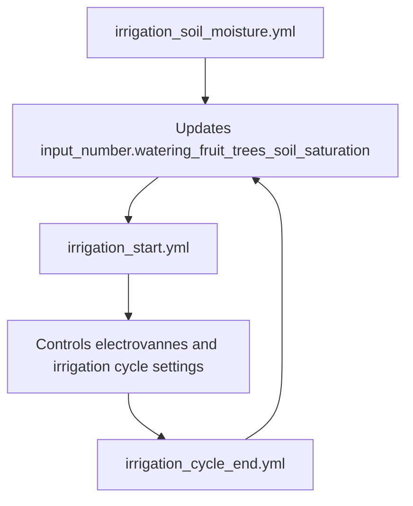

# Fruit Trees Irrigation Automations

This folder contains the three Home Assistant automations that model and control irrigation for the fruit trees.

## Files

- [irrigation_start.yml](irrigation_start.yml)
- [irrigation_soil_moisture.yml](irrigation_soil_moisture.yml)
- [irrigation_cycle_end.yml](irrigation_cycle_end.yml)

## Overview

The system is split into three parts:

1. The soil moisture model estimates the current soil saturation.
2. The start automation decides when irrigation should begin.
3. The cycle-end automation updates the soil saturation after watering stops.



## Shared Inputs And Entities

The automations rely on these main Home Assistant entities:

- `input_number.watering_fruit_trees_soil_saturation`
- `switch.electrovanne`
- `switch.electrovanne_state`
- `select.electrovanne_mode`
- `number.electrovanne_irrigation_target`
- `number.electrovanne_cycle_irrigation_num_times`
- `number.electrovanne_cycle_irrigation_interval`
- `sensor.electrovanne_water_consumed`
- `input_boolean.watering_fruit_trees_debug`
- `input_boolean.fruit_trees_debug`

## 1. `irrigation_start.yml`

### Purpose

This automation decides whether irrigation should start every 10 minutes.

### Decision logic

It starts irrigation only when all of these conditions are true:

- soil saturation is below `start_threshold`
- the valve is currently off
- the computed target irrigation volume is greater than zero
- the current time is inside the allowed irrigation window

### Time window

Irrigation is allowed only between:

- `irrigation_window_start: 07:30:00`
- `irrigation_window_end: 16:30:00`

### Main variables

- `start_threshold`: saturation threshold below which irrigation can start
- `target_soil_saturation`: desired saturation after irrigation
- `irrigation_cycle_volume`: volume used for one irrigation cycle, in liters
- `cycle_interval`: delay between cycles, in seconds
- `irrigation_fraction`: fraction of the estimated deficit that should actually be applied
- `water_capacity`: total modeled usable water capacity, in liters

### What it does

When irrigation should start, the automation:

- switches the valve mode to `capacity`
- sets the target irrigation volume
- sets the number of cycles
- sets the interval between cycles

## 2. `irrigation_cycle_end.yml`

### Purpose

This automation runs when irrigation stops and updates the estimated soil saturation.

### Trigger

It triggers when `switch.electrovanne_state` changes from `on` to `off`.

### Main variables

- `irrigation_volume`: actual volume consumed by the valve, in liters
- `soil_saturation`: current saturation value before update, in percent
- `water_capacity`: total modeled usable water capacity, in liters
- `irrigation_efficiency`: fraction of delivered water assumed to reach the root zone

### What it does

The automation:

- computes the gain in soil saturation from the delivered irrigation volume
- clamps the new saturation between 0 and 100 percent
- stores the new value in `input_number.watering_fruit_trees_soil_saturation`
- posts a notification with the delivered volume and estimated new saturation

## 3. `irrigation_soil_moisture.yml`

### Purpose

This automation is the soil moisture digital twin. It estimates the next soil saturation value from weather and evapotranspiration inputs.

### Trigger

It runs every 10 minutes.

### Main model inputs

- `location`: base location name used to build weather sensor entity IDs
- `tree_count`: number of trees represented by the model
- `individual_root_zone_area`: root zone area for one tree, in square meters (m2)
- `root_zone_area`: total modeled root zone area, in square meters (m2)
- `root_zone_depth`: modeled root zone depth, in meters (m)
- `root_zone_volume`: modeled soil volume, in cubic meters (m3)
- `usable_water_storage`: usable water storage density, in liters per cubic meter (L/m3)
- `water_capacity`: total usable water capacity, in liters (L)

### Geometry model

The model uses:

```text
root_zone_area = tree_count * individual_root_zone_area
root_zone_volume = root_zone_area * root_zone_depth
water_capacity = root_zone_volume * usable_water_storage
```

### Soil texture calibration

`usable_water_storage` is the soil-type parameter.

Suggested starting values:

- sand: 100 to 130 L/m3
- loam: 140 to 170 L/m3
- clay: 180 to 220 L/m3

The current setting uses clay-like behavior.

### Weather inputs

The model reads weather from sensors based on `location`, for example:

- `sensor.<location>_temperature`
- `sensor.<location>_humidity`
- `sensor.<location>_wind_speed`
- `sensor.<location>_uv`

It also uses:

- `sensor.openweathermap_rain_intensity`
- `switch.electrovanne_state`

### What it calculates

The automation estimates:

- reference evapotranspiration (`et0`)
- crop evapotranspiration (`crop_et`)
- fast and slow water loss
- rain gain
- drainage loss
- new soil saturation

### Debug output

If `input_boolean.fruit_trees_debug` is on, the automation creates a persistent notification with the input values and intermediate calculations.

## Recommended Calibration Workflow

1. Set `tree_count` to the number of trees represented by the model.
2. Measure or estimate `individual_root_zone_area` for one tree, in m2.
3. Set `root_zone_depth` in meters.
4. Choose `usable_water_storage` based on soil texture or a real soil test.
5. Check that the resulting `water_capacity` matches the physical size of the modeled root zone.
6. Tune `start_threshold`, `target_soil_saturation`, and `irrigation_fraction` if the watering behavior is too aggressive or too conservative.

## Notes

- All saturation values are in percent.
- All irrigation and water capacity values are in liters.
- `root_zone_area` is derived from tree count and per-tree area, so the model can be adapted to a different number of trees without changing the irrigation logic.
